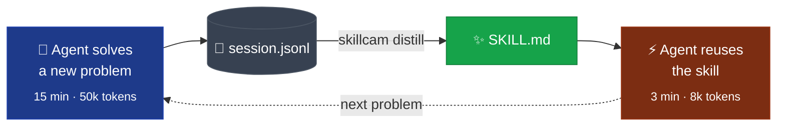
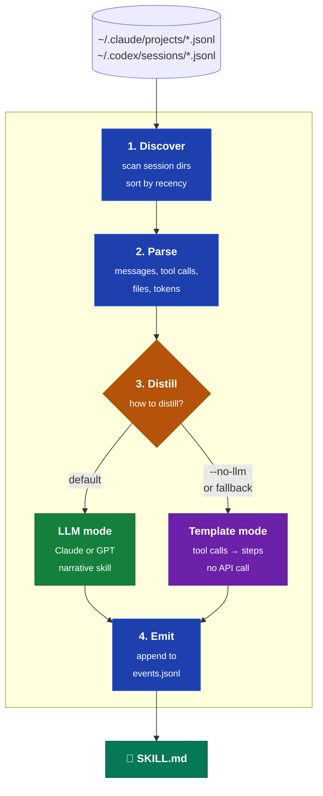
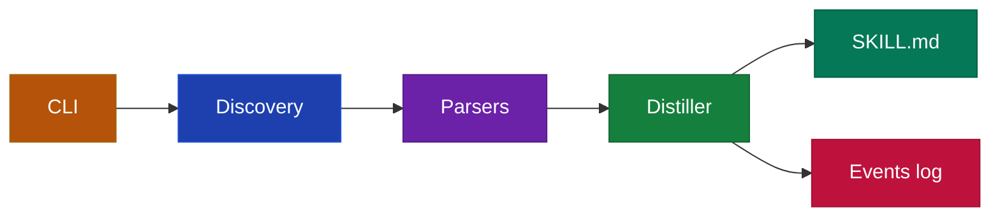

<p align="center">
  
</p>

<h1 align="center">SkillCam</h1>

<p align="center">
  Turn successful AI agent runs into reusable markdown skills.<br>
  Stop solving the same problem twice.
</p>

<p align="center">
  <a href="https://www.npmjs.com/package/skillcam"></a>
  <a href="LICENSE"></a>
  <a href="https://www.npmjs.com/package/skillcam"></a>
</p>

---

## The Problem

Your AI coding agents solve problems every day. They read files, run tools, iterate on solutions, and eventually get it right. Then they forget everything.

Next time the same problem shows up, the agent starts from scratch. Same research, same trial and error, same token burn. You're paying for the same work twice.

## The Solution

SkillCam reads native session logs from Claude Code and Codex CLI, extracts the successful pattern, and writes it as a clean `SKILL.md` file. Next time the agent sees the same kind of task, it reads the skill and follows the steps instead of figuring it out again.

One command. No config. Works with any LLM or without one.

```bash
npx skillcam distill --latest
```

## Before and After

```
Before SkillCam:

  You: "Fix the auth tests"
  Agent: *figures it out from scratch* (15 min, 50k tokens)

  Next week:
  You: "Fix the auth tests again"
  Agent: *figures it out from scratch again* (15 min, 50k tokens)
```

```
After SkillCam:

  You: "Fix the auth tests"
  Agent: *figures it out* (15 min, 50k tokens)

  $ skillcam distill --latest
  > Wrote skill to ./skills/fix-auth-tests.md

  Next week:
  You: "Fix the auth tests again"
  Agent: *reads the skill, follows the steps* (3 min, 8k tokens)
```

## How It Works

SkillCam reads an agent session from disk, extracts what worked, and writes a `SKILL.md` your agent can reuse next time.

### The loop it creates



One session becomes one skill. One skill turns the next run from a fresh discovery into a quick execution.

### The pipeline



### Two distill modes

| Mode | When to use | What happens |
|------|-------------|--------------|
| **LLM mode** (default) | You want polished, narrative skills | Sends a truncated view of the session to Claude or GPT with a distillation prompt. Produces clean "when to use", concrete steps, and summarized decisions. |
| **Template mode** (`--no-llm`) | No API key, cost-sensitive, or sensitive session content | Extracts steps directly from tool calls. Deterministic, structured, zero network calls. SkillCam falls back here automatically if the LLM call fails. |

### What each stage does

- **Discover** — scans `~/.claude/projects/` and `~/.codex/sessions/` for `.jsonl` files. Each agent format has its own parser. Sessions are sorted by most recent first.
- **Parse** — reads the raw JSONL into a typed shape: user/assistant messages, tool calls with inputs/outputs, files modified, token usage, project metadata.
- **Distill** — converts the parsed session into a reusable skill via either mode above.
- **Emit** — appends a structured event to `agents/_core/events.jsonl` with session metadata, skill path, token costs, and distill mode. This is the shared event contract that future agent-tooling in this ecosystem will read.

## Security

Agent sessions often contain secrets (API keys, tokens, private file contents). In LLM mode, SkillCam scans the distillation prompt for common secret patterns before sending it to the provider. If any are found, it aborts by default. You can redact and continue with `--redact`, bypass with `--allow-secrets`, or stay fully local with `--no-llm`. Full threat model and reporting instructions in [`SECURITY.md`](SECURITY.md).

## Installation

```bash
# Use directly (no install needed)
npx skillcam distill --latest

# Or install globally
npm install -g skillcam
```

## CLI Reference

### `skillcam list`

List available agent sessions.

```bash
skillcam list                        # Show 10 most recent sessions
skillcam list --agent claude-code    # Only Claude Code sessions
skillcam list --agent codex          # Only Codex CLI sessions
skillcam list --last 20              # Show 20 sessions
```

### `skillcam preview`

Preview what a session did without distilling.

```bash
skillcam preview --latest            # Preview most recent session
skillcam preview <session-id>        # Preview specific session
skillcam preview --latest --agent codex
```

### `skillcam distill`

Distill a session into a reusable SKILL.md.

```bash
skillcam distill --latest                              # Distill most recent session
skillcam distill <session-id>                          # Distill specific session
skillcam distill --latest --no-llm                     # Template mode (no API key needed)
skillcam distill --latest --provider anthropic         # Use Claude for distillation
skillcam distill --latest --provider openai --model gpt-4o  # Use GPT-4o
skillcam distill --latest --output ./my-skills/        # Custom output directory
skillcam distill --latest --redact                     # Redact detected secrets before sending
skillcam distill --latest --allow-secrets              # Send as-is even if secrets are detected
```

By default, `distill` scans the prompt for common secret patterns (API keys, tokens, private keys) and aborts if any are found. See [`SECURITY.md`](SECURITY.md).

## Supported Agents

| Agent | Status | Session Location |
|-------|--------|------------------|
| Claude Code | Supported | `~/.claude/projects/<project>/<session>.jsonl` |
| Codex CLI | Supported | `~/.codex/sessions/YYYY/MM/DD/<session>.jsonl` |
| Gemini CLI | Planned | -- |

## LLM Providers

| Mode | Command | API Key Required |
|------|---------|-----------------|
| Template | `--no-llm` | No |
| Anthropic | `--provider anthropic` | `ANTHROPIC_API_KEY` |
| OpenAI | `--provider openai` | `OPENAI_API_KEY` |

Template mode works for structured extraction. LLM mode produces more natural, actionable skills. If the LLM call fails, SkillCam falls back to template mode automatically.

## Output Format

Skills are standard markdown with YAML frontmatter:

```markdown
---
name: fix-auth-tests
description: Debug and fix authentication test failures
source_session: 6f1d981e-bf14-445b-9786-a4e0ac09df32
source_agent: claude-code
created: 2026-04-12
tags:
  - testing
  - auth
---

# Fix Auth Tests

## When to use
When auth tests are failing after changes to the auth module.

## Steps
1. Read the failing test file to understand assertions
2. Check the auth module for recent changes
3. Fix the mock setup to match new auth flow
4. Run tests to verify

## Example
User: "The auth tests are broken again"
Agent: Reads test, finds mock mismatch, fixes setup, all tests pass.

## Key decisions
- Always update mocks when changing auth flow
- Check both unit and integration test suites
```

See [`examples/skills/`](examples/skills/) for real skills generated from actual sessions.

## Works with Obsidian

SkillCam is CLI-first and markdown-native — **Obsidian is not required**, but the output is designed to work well inside a vault.

- **YAML frontmatter** is Obsidian-compatible: `name`, `description`, `tags`, `created` render in the Properties panel with no config.
- **Skill files are plain markdown**. Drop them anywhere in your vault, link to them with wikilinks (`[[fix-auth-tests]]`), or pull them into a Dataview / Bases query by tag.
- **No plugin to install**. The CLI writes markdown, Obsidian reads markdown. Same files work for agents, for humans, and for CI.

Typical workflow:

```bash
# Distill the session straight into your vault
skillcam distill --latest --output ~/Vault/skills/
```

Add `skills/` to a folder note or to a Base view and your agent skills become searchable alongside your research and daily notes.

If you're an agent-tooling power user or vault-curator, please open an issue with workflows you'd want — a `--vault` flag that reads `$OBSIDIAN_VAULT` is on the roadmap.

## Project Structure

The code is grouped by role. Each layer has one job.

### Data flow



### Files by layer

| Layer | File | Purpose |
|-------|------|---------|
| **CLI** | `src/cli.ts` | Commander entry — `list`, `preview`, `distill` |
| **Discovery** | `src/discovery.ts` | Finds session logs in `~/.claude/projects/` and `~/.codex/sessions/` |
| **Parsers** | `src/parsers/claude-code.ts` | Parses Claude Code JSONL format |
|  | `src/parsers/codex.ts` | Parses Codex CLI JSONL format |
|  | `src/parsers/types.ts` | `ParsedSession` shared shape |
| **Distiller** | `src/distiller.ts` | Orchestrates LLM vs template mode |
|  | `src/distiller-prompt.ts` | Builds the LLM prompt |
| **Events** | `src/events/emit.ts` | Appends structured events to `events.jsonl` |
|  | `src/events/types.ts` | `AgentEvent` schema |
| **Examples** | `examples/skills/` | Real skills generated from sessions |
| **Tests** | `tests/` | Vitest suite |

## Contributing

PRs welcome. Please open an issue first to discuss what you'd like to change.

Some areas where contributions would be useful:

- **New agent parsers** -- Gemini CLI, Cursor, Windsurf, or other agents that produce session logs
- **Better distillation prompts** -- improving the quality of LLM-generated skills
- **Skill validation** -- linting or scoring generated skills for completeness
- **CI integration** -- auto-distilling skills from successful CI runs

### Development

```bash
git clone https://github.com/martin-minghetti/skillcam.git
cd skillcam
npm install
npm run dev -- list          # Run from source
npm test                     # Run tests
npm run build                # Compile TypeScript
```

## Community

- [GitHub Issues](https://github.com/martin-minghetti/skillcam/issues) -- bugs, feature requests, questions
- [GitHub Discussions](https://github.com/martin-minghetti/skillcam/discussions) -- ideas, show & tell, general talk

## License

[MIT](LICENSE)
